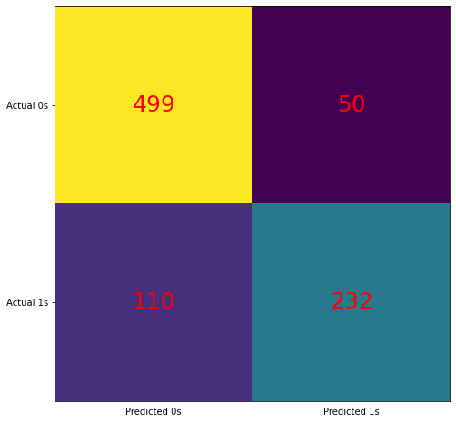
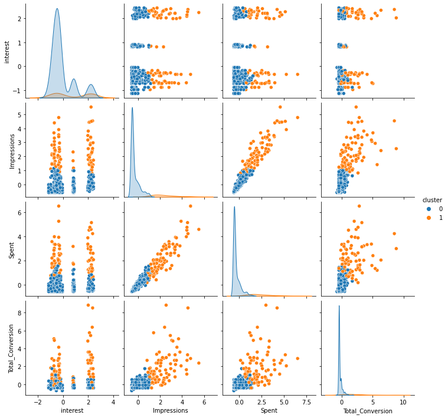
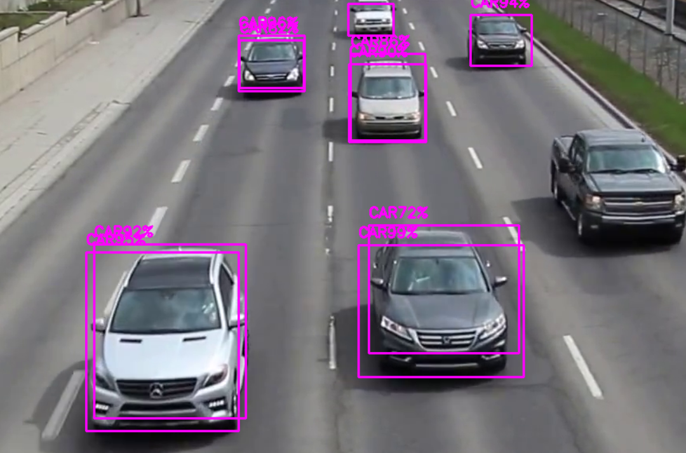
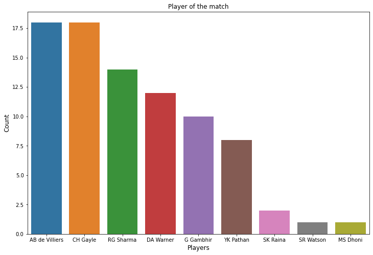
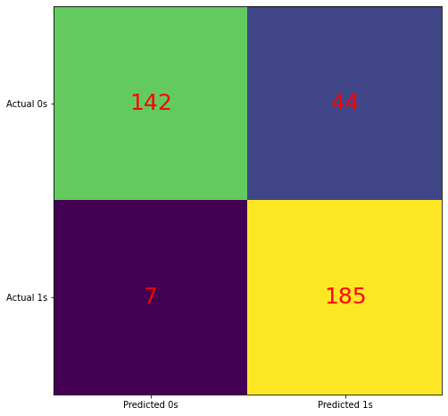
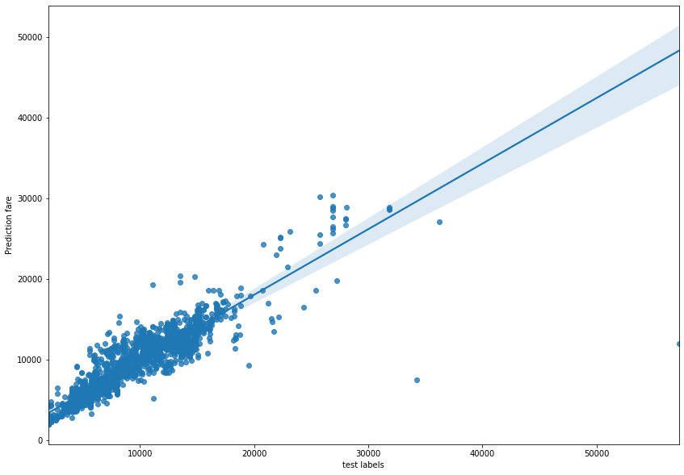

# priyadutt-portfolio

## [**Project: Titanic-Machine Learning from Disaster**](https://github.com/bhatt-priyadutt/Titanic-Machine-learning-from-disaster)

* This project was implemented to predict whether the passengers in the titanic crash survived or not. 
* The prediction was done using features like passenger class, fare, age, embarked.
* I have used hyper parameter tunning to increase the accuracy of the model and implemented on Flask framework in which user would enter the details about the passenger and based on the input, the model predicts whether the passenger survived or not.
* Models used: Logistic Regression, GaussianNB, KNeighborsClassifier.
* Deployed on Heroku [Click Here ](https://titanic-flask-heroku-app.herokuapp.com/).
* Accuracy achieved using logistic regression:82%.

## [**Project: Product-Recommendation-System**](https://github.com/bhatt-priyadutt/product-recommendation-system) 
* Used Collaborative Filtering algorithm to recommend items by finding the correlation between users based on users’ ratings.
* Finding if there is a market bias in the data.
* Approach Used: Collaborative filtering.
* Models Used: Singular value decomposition.

## [**Project: House Price Prediction**](https://github.com/bhatt-priyadutt/house-price-prediction)

* This project was implemented to predict the prices of the house. 
* Prices were predicted by taking some useful features into account like location, size of house (total square feet), No. of rooms, price per square feet etc. 
* During the project, the preprocessing steps that have been performed are:1.) Dealing with missing data. 2.) Encoding categorical variables 3.) Feature Engineering 4.) Finding Correlation within independent variables using heatmap.
* Libraries used: Sklearn, Numpy, Pandas, Matplotlib, Seaborn.
* Models used: Linear Regression, Ridge.
* R2 Score achieved using RidgeCV: 99%  

## [**Project: Cluster Analysis for Ad Conversions Data**](https://github.com/bhatt-priyadutt/Sales-conversion)

* The dataset contains information about the company's ad campaigns and I have analyzed the best campaigns among them.
* In this Project, I have performed Exploratory Data analysis, Feature Scaling and used clustering technique to answer the below business questions:
  1. How to optimize the social ad campaigns for the highest conversion rate possible. (Attain best Reach to Conversion ratios/Click to Conversion ratios)
  2. Finding the perfect target demographics with the appropriate clickthrough rates
  3. Understanding the ideal turnaround/decision making time per age group to convert and retarget future social campaigns
  4. Comparing the individual campaign performance so the best creative/campaign can be run again with adjusted audiences.
* Models used: Kmeans

# [**Project: OpenCV Object Detection**](https://github.com/bhatt-priyadutt/OpenCV-Object-Detection)

* In this project, I implemented an image and video object detection classifier using a pretrained yolov3 model. The approach used in the project was to consider bounding boxes that have a greater confidence level(probability) than the confidence threshold (70%) & assign the shape with one of the classes from pre-defined class names. The rectangle bounding boxes are created across the object with the assigning name of the object. The output generated was video/image having detection of the objects that are highlighted with the rectangle.
* Libraries used: NumPy, OpenCV(cv2), Tkinter

## [**Project: IPL Data Analysis(2008-2019)**](https://github.com/bhatt-priyadutt/IPL-data-analysis)

* In this Project, I have performed Exploratory Data analysis to answer below questions as a sports analyst: 
  1. As a sports analyst, find out the most successful teams, players and factors contributing win or loss of a team.
  2. Suggest teams or players a company should endorse for its products.

## [**Project: Stock Sentiment Analysis**](https://github.com/bhatt-priyadutt/stock-sentiment-analysis)

* This project was implemented to predict whether the company’s stock price increases or decreases. 
* Based on the headlines of various sources about a company, I performed sentiment analysis to predict the price increase or decrease.
* Models Used: RandomForestClassifier.
* Methods Used: Count Vectorizer.
* Accuracy achieved using RandomForestClassifier: 86%

## [**Project: Flight Fare Prediction**](https://github.com/bhatt-priyadutt/flight-fare-prediction)

* This project was implemented to predict the prices of flights. The parameters used for prediction were Date of journey, duration, source, destination, total stops etc. Also, I have used hyper parameter tunning for better accuracy/performance of model.
* Models used: RandomForestRegressor, LinearRegression.
* Accuracy achieved by using RandomForestRegressor: 81% 

